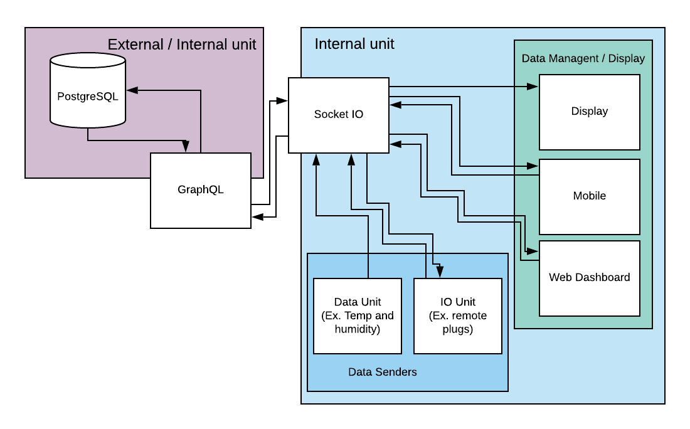

-- Well, a Home Automation System that is Open Source... Okay! --

## Info

An OpenSource project that allows you to combine applications and/or add your own apps to be used.
The system can be used both as a closed environment only accessible from your home network or as an open environment where you can control your home from anywhere.

To be used as an open system you need to host the database and GraphQL-API on a server accessible from the internet.

The central hub/heart of the system is Socket.IO where all data is sent to and from there stored or sent to the client in need of the data.
The majority of data processed is intended to be data consumed of the information systems that contain mobile applications, web interface and/or a data display.

The idea is to create a base for other applications to be built around Whasoka. Build a plant monitoring application that shows the statistics or send the data directly to a watering system that you have built with an arduino? Or why not add a module that based on time sends signals that control the strength of your led stripes?

If you choose to add an external data storage you will be able to build applications with geofencing that would allow light sources to be turned on/off depending where you are. Or manually control it from a mobile app.

The possibilities is endless!

As shown in the above picture, the "Data Senders" is module examples and some upcoming sections of work. Also the "Data Management / Display" Is currently not built.

## Data Structure

### Message within Databroaker

    [JSON]
    {
        socket: [socket.io-client],
        me: [string],
        myId: [socket-id],
        myKey: [string],
        target: [string],
    }

    me: name of the unit, set by the user. Ex: "TempLivingroom"
    myId: is set by data broker when the unit connects
    myKey: password set in data broker. gives some kind of security...
    target: name of the target application. Ex TempMessurmentApp, is used to save data to DB
